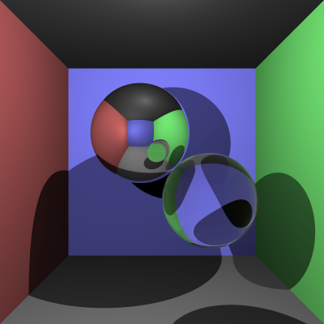

# COMP30019 - Project 1 - Ray Tracer

This is your README.md... you should write anything relevant to your
implementation here.

Please ensure your student details are specified below (*exactly* as on UniMelb
records):

**Name:** Zilun Li \
**Student Number:** 1135273 \
**Username:** zilunl \
**Email:** zilunl@student.unimelb.edu.au

## Completed stages

Tick the stages bellow that you have completed so we know what to mark (by
editing README.md). **At most 9** marks can be chosen in total for stage
three. If you complete more than this many marks, pick your best one(s) to be
marked!

<!---
Tip: To tick, place an x between the square brackes [ ], like so: [x]
-->

##### Stage 1

- [x] Stage 1.1 - Familiarise yourself with the template
- [x] Stage 1.2 - Implement vector mathematics
- [x] Stage 1.3 - Fire a ray for each pixel
- [x] Stage 1.4 - Calculate ray-entity intersections
- [x] Stage 1.5 - Output primitives as solid colours

##### Stage 2

- [x] Stage 2.1 - Diffuse materials
- [x] Stage 2.2 - Shadow rays
- [x] Stage 2.3 - Reflective materials
- [x] Stage 2.4 - Refractive materials
- [x] Stage 2.5 - The Fresnel effect
- [x] Stage 2.6 - Anti-aliasing

##### Stage 3

- [ ] Option A - Emissive materials (+6)
- [ ] Option B - Ambient lighting/occlusion (+6)
- [x] Option C - OBJ models (+6)
- [ ] Option D - Glossy materials (+3)
- [x] Option E - Custom camera orientation (+3)
- [x] Option F - Beer's law (+3)
- [ ] Option G - Depth of field (+3)

*Please summarise your approach(es) to stage 3 here.*
In stage3, I did Option C(OBJ models), Option E(Custom camera orientation) and Option F(Beer's law). 

For Option C, I implemented the bunny display in the obj file and smoothed the bunny surface with vn to make it look more rounded. And I also use the sphere - bounding box, which optimizes the speed of detecting the light hitting the rabbit(But since my computer is too old, after I did this step, the speed got some improvement but it still took much time).

For Option E, I implemented the camera rotation function, which can rotate the camera around the origin of the world coordinate system. The camera can rotate around the x-axis, y-axis and z-axis. The camera can also rotate around the origin of the world coordinate system in any direction. 

For Option F, I implemented the Beer's law function, which can make the light passing through the object more realistic. The light passing through the object will be attenuated by the Beer's law function. The attenuation coefficient is determined by the material of the object.

## Final scene render

Be sure to replace ```/images/final_scene.png``` with your final render so it
shows up here.


This render took **18** minutes and **45** seconds on my PC.

As I mentioned before, I have used the sphere - bounding box, which optimizes the speed of detecting the light hitting the rabbit(But since my computer is too old, after I did this step, the speed got some improvement but it still took much time, hopefully it will improve some speed on your PC not a problem with my code)

On the output of final_scene, I added a normal MirrorMat and a GlassMat ball, a Refractive Sphere with the colour (4, 1, 1) to make their combination look like a Mickey Mouse shape, with a bunny here Below, there is also a slight angle of rotation.


I used the following command to render the image exactly as shown:

```
dotnet run -- -f tests/final_scene.txt -o output.png -p 0.1,0,0.2 -a 0,0,1 -n -0.3
```

## Sample outputs

We have provided you with some sample tests located at ```/tests/*```. So you
have some point of comparison, here are the outputs our ray tracer solution
produces for given command line inputs (for the first two stages, left and right
respectively):

###### Sample 1

```
dotnet run -- -f tests/sample_scene_1.txt -o images/sample_scene_1.png -x 4
```

<p float="left">
  
   
</p>

###### Sample 2

```
dotnet run -- -f tests/sample_scene_2.txt -o images/sample_scene_2.png -x 4
```

<p float="left">
  
   
</p>

## References

*You must list any references you used - add them here!*
For stage 1 and 2, the most of the references I use are from the website mentioned in the power point: Scratchapixel
https://www.scratchapixel.com/index.php

For stage 3C, I still use the website with specific page
https://www.scratchapixel.com/code.php?id=13&origin=/lessons/3d-basic-rendering/introduction-to-shading

For stage 3E, I studied and found the calculation formula in the following two web pages
https://stackoverflow.com/questions/14607640/rotating-a-vector-in-3d-space
https://en.wikipedia.org/wiki/Rodrigues%27_rotation_formula

For stage 3F, I achieved my goal by studying and reading the following websites
https://www.flipcode.com/archives/Raytracing_Topics_Techniques-Part_3_Refractions_and_Beers_Law.shtml
and https://blog.demofox.org/2017/01/09/raytracing-reflection-refraction-fresnel-total-internal-reflection-and-beers-law/


